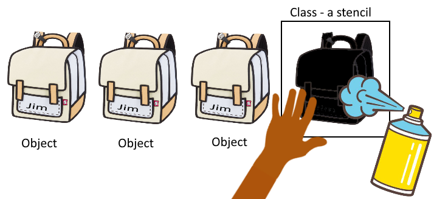
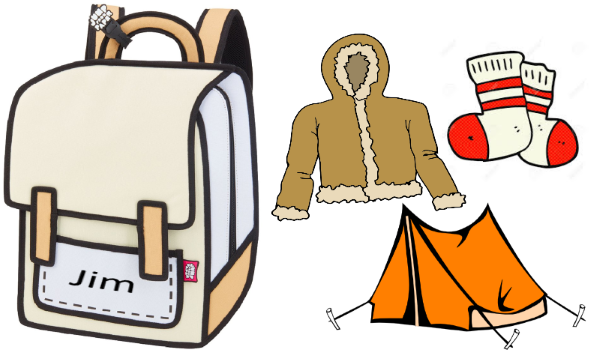
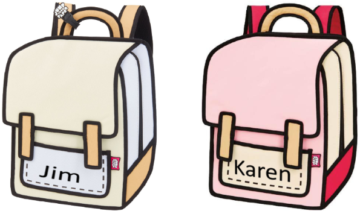

# The Difference Between a Class and an Object

## TL;DR

> First you write a class to define the desired methods and properties, then use that class as an object to set and call those properties and methods.

## How Classes and Objects Differ

A class and an object represent the same concepts, but the class is the definition of the concepts you are trying to describe.  The class really only exists as a set of concepts about what something is and how it should operate.  All the properties (adjectives) and methods (verbs) are defined in the class (noun).  A class by itself cannot do anything useful because it is only the definition of a set of concepts.  To do something useful, you need to create an object from that class.

Creating an object from a class is where the fun begins.  You may create as many objects from the same class as you need to do actual useful work.  Some or all of those properties may be set when you instantiate (create) the object from your class via its constructor (a special type of method), or you may be able to set more properties later by calling some of its methods (setters).  You will also be able to have your object perform certain functionality by calling its methods which could let you get information back out of the object (getters).  This may be a lot to take in at first, so let's proceed with a real-world example.

## Design a Useful Class - a Backpack

Let's start off by designing a simple class that will define the properties and methods of a backpack and exercise it a little bit.  What do you do with a backpack?  Well, when you buy it, you might want to write your name on it or have it embroidered with your name so you can identify it among a group of other backpacks that might be that same make, model, and color.  The second thing you are likely to do is to pack it with other items you bought at the same time so you can go on your grand adventure.

### **`Think our class as a stencil, and paintings of backpacks as the objects`**



The illustration above shows us using our stencil (class) to paint as many pictures of backpacks (objects) as we need.  We can use different colors of paint for each backpack we paint.  They do not need to all be the same, but they will all have the same shape once they are painted.

## Coding a Backpack Class and Objects in Javascript

Let's jump right into looking at some code that defines a backpack class.  We are using javascript for this example.

### **`backpackClass.js`**

``` javascript
// Define a class to represent a backpack
class Backpack {
  constructor(nameTag, contents) {
    this.nameTag = nameTag;
    this.mainContents = [contents];
    console.log(`You have ${nameTag}'s backpack with ${contents} in it.`);
  }

  // Getter methods
  readNameTag() {
    console.log(`This backpack belongs to ${this.nameTag}.`);
  }

  lookInMainCompartment() {
    console.log(`The main compartment contains ${this.mainContents}.`);
  }

  // Setter methods
  addItemToMainCompartment(item) {
    this.mainContents.push(item);
    console.log(`You have placed ${item} into ${this.nameTag}'s backpack.`);
  }

  removeItemFromMainCompartment(item) {
    var itemLocationInBag = this.mainContents.indexOf(item);
    if (itemLocationInBag > -1) { // Did we find our item?
      this.mainContents.splice(itemLocationInBag, 1);  // Remove the 1 item
      console.log(`You have removed ${item} from ${this.nameTag}'s backpack.`);
    } else {
      console.log(`Your backpack does not contain ${item}.`);
    }
  }

  empty() {
    console.log(`You have dumped ${this.mainContents} on the ground.`);
    this.mainContents = [];
  }
}

// This lets other code use this class to create objects
module.exports = Backpack;
```

We have started out by creating the class and giving it a name of Backpack.  That will be important when we want to make this class available to other javascript code that wants to create objects from this class.  The first method is the constructor, and it will want us to give the backpack a name and an initial item to put into the backpack.  It will store these values in properties, accessed from the class by the keyword *this*.  The nameTag is set as a simple string, whereas the contents are set as an array, because a backpack can hold many different items as its contents.  This simple example can only accept one item when creating the object, but we could expand on that later to accept a string or a list of strings to make the constructor much more powerful.

The next few lines are all the methods we are defining for this class.  You can think of these as verbs.  They take some action on the class, usually setting or getting properties of the class.  The first two are simply getting the nameTag or contents of the backpack and displaying them.  The next three are modifying the contents - either adding or removing items from the mainCompartment of the backpack.  Adding items is simple - just add more elements to the array of contents.  Removing items is more complicated because we have to find the item first, and remove it only if it is already in the backpack.  Emptying the backpack is simplest of all - just remove all the contents.

## Create an Object with the Backpack Class - myBackpack

Now that we have our class defined, we need to be able to use this class in a useful way.  The following code will create an object from our class so we can manipulate and examine it.

### **`object.js`**

``` javascript
// Load up our class definition for a backpack
const Backpack = require('./backpackClass.js');

// Create an instance of backpack for me and make sure its mine
let myBackpack = new Backpack("Jim", "tent");
myBackpack.readNameTag();

// Now lets put a jacket & socks inside and inspect the contents
myBackpack.addItemToMainCompartment("jacket");
myBackpack.addItemToMainCompartment("socks");
myBackpack.lookInMainCompartment();  // There should be 3 items now

// What happens if we try to remove something not in the backpack?
myBackpack.removeItemFromMainCompartment("stove");  // There is no stove

// Lets empty the backpack and make sure it is empty
myBackpack.empty();
myBackpack.lookInMainCompartment();  // Should be empty now
```

The code starts out by loading the class from the class file and assigning it to an object class of Backpack.  It is still not an object yet, it is still just a class definition.  The next line is where the magic happens.  We are creating an object (myBackpack) from the class (Backpack).  When we create our new object, we are passing it parameters that it is expecting to be a nameTag and a single item.  At this point we can inspect the nameTag to be sure it is our backpack (Jim's).

Next, we will add a jacket and socks into the backpack and make sure the contents include the item we put into it when we created it (a tent), along with these two new items.

Our next operation is to try to remove something that does not exist in the backpack yet (stove) and it tells us we do not have a stove in the backpack.

Finally we empty the backpack, and inspect the main compartment and see that it is indeed empty.

This is what we would see if we run this code with a javascript interpreter like Node.js.

### **`Console output from Node.js for object.js`**

``` console
> node code/simple/object.js
You have Jim's backpack with tent in it.
This backpack belongs to Jim.
You have placed jacket into Jim's backpack.
You have placed socks into Jim's backpack.
The main compartment contains tent,jacket,socks.
Your backpack does not contain stove.
You have dumped tent,jacket,socks on the ground.
The main compartment contains .
>
```



## Objects Multiplying the Power of Classes

We mentioned earlier that because objects are what bring classes to life, we do not have to stick to just one object per class.  I don't need to be restricted to having just one backpack, I can buy another one for my wife and they remain totally separate.  I could even buy seven of them if I wanted and put the days of the week on their nameTag.  Let's look at another code sample.

### **`object2.js`**

``` javascript
// Load up our class definition for a backpack
const Backpack = require('./backpackClass.js');

// Create an instance of backpack for me and my wife
let myBackpack = new Backpack("Jim", "tent");
let herBackpack = new Backpack("Karen", "socks");

// Now let's put food in mine and binoculars in hers
myBackpack.addItemToMainCompartment("sandwich");
herBackpack.addItemToMainCompartment("binoculars");

// Let's see what's inside each of our packs now
myBackpack.readNameTag();
myBackpack.lookInMainCompartment();
herBackpack.readNameTag();
herBackpack.lookInMainCompartment();
```

In this example, we are buying (creating) two backpacks and putting different labels on them and different items in them.  But at the end, we should be able to see that each backpack is unique and contains only the items put into the respective individual backpacks.

### **`Console output from Node.js for object2.js`**

``` console
> node code/simple/object2.js
You have Jim's backpack with tent in it.
You have Karen's backpack with socks in it.
You have placed sandwich into Jim's backpack.
You have placed binoculars into Karen's backpack.
This backpack belongs to Jim.
The main compartment contains tent,sandwich.
This backpack belongs to Karen.
The main compartment contains socks,binoculars.
>
```



## Summary Thoughts on Objects and Classes

I hope you now have a pretty clear understanding of what the difference between a class and an object is.  Next week we will amplify the power of classes by introducing *inheritance* and show how to build classes that can combine other classes to represent more complex ideas.  Perhaps we will create a hiker class that will need this backpack class to take a trip across the forest.

If you would like to run this code for yourself, try it out on [repl.it](https://repl.it/@JimBledsoe/Learning-computer-science) or just browse it on [GitHub](https://github.com/JimBledsoe/Learning-computer-science).
